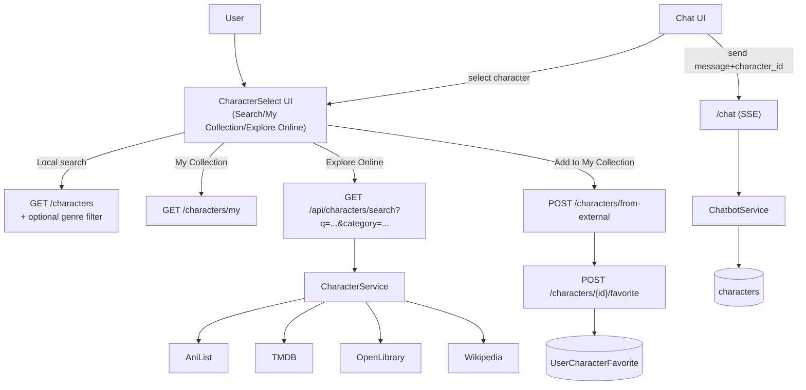

## Third‑party characters, collections & UI revamp

### 1. Backend data model & migrations

- **Extend `Character` model** in `backend/src/models/character.py` to support new metadata:
  - Add fields like `genre` (string or enum), `source` (e.g., `local`, `tmdb`, `anilist`, `openlibrary`, `wikipedia`), `image_url` (string), and possibly `external_id` (for TMDB/AniList/OpenLibrary IDs).
  - Update `backend/src/schemas/character.py` to expose these fields in `CharacterBase`/`Character` and allow optional values in `CharacterCreate`/`CharacterUpdate`.
  - Create a new Alembic migration under `backend/alembic/versions` to add these columns to the `characters` table with safe defaults (e.g., `NULL` for new fields; existing rows default `source='local'`).
- **Add per-user collection model**:
  - Create a new model `UserCharacterFavorite` (or similar) in `backend/src/models` with `id`, `user_id` (FK), `character_id` (FK), `created_at`, and a uniqueness constraint on `(user_id, character_id)`.
  - Add corresponding pydantic schemas in a new or existing schema file (e.g., `backend/src/schemas/character.py` or a dedicated `favorites.py`).
  - Add an Alembic migration to create this table and foreign keys against `users` and `characters`.

### 2. Third‑party API integration layer

- **Centralize external character search in `CharacterService`** (`backend/src/services/character_service.py`):
  - Keep existing D&D and AniList functionality.
  - Add TMDB support (using `TMDB_API_KEY` from env):
    - Implement helpers like `search_tmdb_person_or_character(query: str)` for movie/TV characters and actors, returning normalized data including name, media title, overview, and poster/profile image URLs.
  - Add OpenLibrary support for book characters/authors:
    - Implement `search_openlibrary_character_or_author(query: str)` using OpenLibrary search APIs and normalizing to the same character shape where possible (e.g., character/author name, primary work title, short description, cover image if available).
  - Add Wikipedia/Wikidata fallback:
    - Implement a simple search using the Wikipedia search API (and optionally a follow-up detail fetch) to resolve long‑tail characters, returning name, a short extract/description, page URL, and an image thumbnail if available.
  - Define a unified normalized return type (e.g., `ExternalCharacterResult`) with: `name`, `universe_title` (movie/series/book), `description`, `image_url`, `genre` (best effort), and `source`.
- **Routing for search** (`backend/src/routes/characters.py`):
  - Extend or add routes like `GET /api/characters/search` accepting query params:
    - `q` (search term), `category` (enum: `anime`, `movie`, `tv`, `bollywood`, `book`, `other`), and optional `limit`.
  - Inside the handler, delegate to the appropriate service method(s) based on `category`:
    - Anime → existing AniList search.
    - Hollywood/Bollywood/TV → TMDB (person/character search) and fallback to Wikipedia.
    - Books → OpenLibrary and fallback to Wikipedia.
    - Other/fiction catch‑all → direct Wikipedia search.
  - Normalize and return a list of external character candidates, not yet persisted in DB.

### 3. Creating characters from external results & custom input

- **Endpoint to persist external characters**:
  - Add a route such as `POST /characters/from-external` in `backend/src/routes/character.py`:
    - Request body includes fields like `name`, `universe` (movie/show/book), `chat_style` (optional initial style), `example_responses` (optional), `genre`, `source`, `image_url`, and `external_id`.
    - Use `CharacterCreate` extended with new optional fields; optionally auto‑generate a basic `chat_style` and sample `example_responses` from external description using a simple heuristic or LLM call later (for now, keep manual or default values).
    - Return the created `Character` in the new enriched schema.
- **Endpoint to create fully custom characters**:
  - Reuse existing `POST /characters` in `backend/src/routes/character.py` but:
    - Allow passing optional `genre` and `image_url` from the frontend when user creates a custom character in `AddCharacterModal`.
    - Make sure `CharacterCreate` allows those optional fields and they’re saved to the DB.

### 4. My Collection (per-user favorites)

- **Backend routes**:
  - Add a new router (e.g., `backend/src/routes/favorites.py`) or extend `character.py` with:
    - `POST /characters/{character_id}/favorite` – mark a character as favorite for the current authenticated user.
    - `DELETE /characters/{character_id}/favorite` – remove favorite.
    - `GET /characters/my` – list the current user’s favorite characters, joining `UserCharacterFavorite` with `Character` and returning full character objects.
  - Protect all routes with `Depends(auth.get_current_user)`.
- **Service logic (optional)**:
  - If logic grows, add a small `favorites_service` to encapsulate favorite creation/removal and duplicate checking.

### 5. Cleaning up `character_###` & assigning correct genres

- **Data cleanup strategy**:
  - Write a one‑off script (or enhance `backend/src/scripts/cleanup_duplicates.py`) to:
    - Identify rows where `name` matches patterns like `Character_\d+` or similar synthetic patterns.
    - Either delete those rows outright or mark them as `source='generated'` and exclude them from default queries, based on your preference.
  - Run this script locally/once in each environment as part of deployment steps.
- **Genre assignment**:
  - Add a maintenance script (e.g., `backend/src/scripts/tag_character_genres.py`) that:
    - Looks at `movie`, `chat_style`, and possibly external IDs.
    - Uses a simple mapping or keyword heuristics to assign one of: `scifi`, `drama`, `comedy`, `action`, `fantasy`, etc., to the new `genre` field.
  - Optionally, for high‑value characters, you can manually override or seed curated genre tags in a JSON/CSV file that the script reads and applies first, then falls back to heuristics.
- **Filter logic at API level**:
  - Update `GET /characters` in `backend/src/routes/character.py` to accept optional `genre` filter and exclude temporary/generated characters if you decide not to delete them (e.g., `where source != 'generated'`).

### 6. Frontend: search, collections & custom characters

- **Expand API client** (`frontend/src/services/api.ts`):
  - Extend `Character` interface with `genre?: string`, `source?: string`, and `image_url?: string`.
  - Add typed functions:
    - `searchExternalCharacters(q: string, category: string): Promise<ExternalCharacterResult[]>` hitting the new `/api/characters/search` route.
    - `favoriteCharacter(characterId: number)` and `unfavoriteCharacter(characterId: number)` calling the new backend routes.
    - `fetchMyCharacters(): Promise<Character[]>` hitting `/characters/my`.
    - Update `createCharacter` to accept optional `genre` and `image_url`.
- **Character selection UI** (`frontend/src/components/CharacterSelect.tsx`):
  - Add a search mode toggle/tabs: **“My Collection”**, **“All Local”**, and **“Explore Online”**.
  - For **My Collection**:
    - Load favorites via `fetchMyCharacters` on open; show them in the grid, preserving existing search bar and genre chip filters, but now driven by the explicit `genre` field if present.
  - For **All Local**:
    - Continue to use `fetchCharacters`, but visually differentiate local vs external using the `source` badge.
  - For **Explore Online**:
    - Use the existing search input to trigger `searchExternalCharacters` when the user types and hits search.
    - Render external results as cards similar to local characters, but with a prominent **“Add to My Collection”** button.
    - On click, call the `from-external` backend endpoint, then automatically favorite that new character and refresh both the local list and My Collection.
  - For each card (local and external-based), add a **favorite toggle icon** (e.g., a heart) that calls `favoriteCharacter`/`unfavoriteCharacter`; overlay this in the top‑right corner.
- **Custom character creation UI** (`frontend/src/components/AddCharacterModal.tsx`):
  - Extend the form to include optional fields:
    - `Genre` – dropdown of allowed genres (`action`, `drama`, `comedy`, `scifi`, `fantasy`, etc.).
    - `Image URL` – or a simple image upload stub for future; for now, a URL text field is enough.
  - Update the `onAdd` handler to send these fields to the backend via `createCharacter`.
  - Optionally, after creation, auto‑add this new custom character to **My Collection**.

### 7. UI polish & character images

- **Character card visuals** (`CharacterSelect` and any other places characters appear):
  - Replace the plain initial avatar with:
    - If `image_url` exists, show it in a rounded thumbnail or hero image at the top of the card.
    - Fallback to the current gradient avatar if no image is available.
  - Add small badges for:
    - `genre` (chip styled with a color per genre).
    - `source` (e.g., “TMDB”, “AniList”, “Wikipedia”, “Custom”) in a subtle label.
- **Chat UI integration** (`frontend/src/components/Chat.tsx`):
  - Where the currently selected character is shown in the header, include the new avatar image and genre badge.
  - Optionally, show a small tooltip or subtext with the source (“From TMDB”, “From Wikipedia”) to make the experience feel more polished.
- **Overall styling**:
  - Maintain the existing gray/purple Tailwind theme but:
    - Slightly increase card padding, rounding, and shadows for a more modern feel.
    - Ensure responsive layout of the character grid and new tabs on mobile.

### 8. Flow overview

### 9. Validation, testing & rollout

- **Backend tests**:
  - Add or extend unit tests (e.g., in `backend/tests/test_endpoints.py`) to cover:
    - New search route(s) returning normalized data for each external source (mock external APIs).
    - Favorites endpoints correctly creating/removing rows and respecting auth.
    - `GET /characters` genre filtering and suppression of `Character_###` rows.
- **Frontend tests**:
  - Add simple Jest/RTL tests around `CharacterSelect` and `AddCharacterModal` to verify:
    - Tabs/switching between local, My Collection, and Explore Online.
    - Favoriting/unfavoriting behavior updates UI state.
- **Deployment checklist**:
  - Add `TMDB_API_KEY` (and any other new env vars) to backend config and deployment environment.
  - Run Alembic migrations.
  - Run cleanup scripts once to remove or flag `character_###` rows and backfill genres.